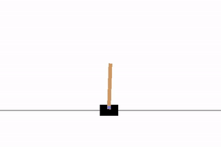

# Deep Q-Network (DQN) solving CartPole-v0
A full explanation can be found under the [notebook](https://nbviewer.jupyter.org/github/Chrispresso/reinforcement_learning/blob/master/gym_solutions/CartPole-v0/dqn_notebook.ipynb). This results in the agent being able to solve the environment in `45 episodes`. 

The equations may or may not display properly on Github, so I've linked the above notebook through https://nbviewer.jupyter.org/.

Here is a Gif of the final policy learned: 

This could be trained better if given more time and not stopped at a maximum of 200 reward. For the OpenAI Gym Environment, however, this will do. There are also better algorithms that could have been used, or hyperparameters that could be tweaked. Also depending on the starting state of the parameters of the Q-Network, training may take more or less than 45 episodes since there is no guarantee on starting values.